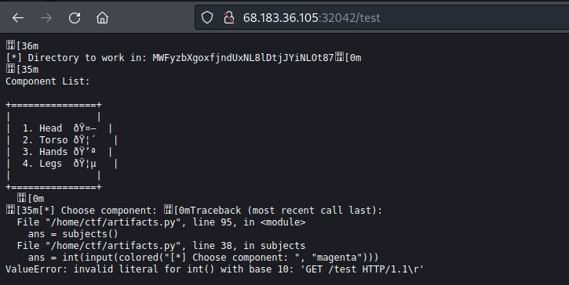

# Writeup "Compressor"

## Quick Info

<table>
   <tr><td><b>site</b></td><td>Hack the box</td></tr>
   <tr><td><b>url</b></td><td>https://app.hackthebox.com/challenges/compressor</td></tr>
   <tr><td><b>discussion</b></td><td>https://forum.hackthebox.com/t/official-compressor-discussion</td></tr>
   <tr><td><b>type</b></td><td>challenge/misc</td></tr>
   <tr><td><b>difficulty&nbsp;&nbsp;&nbsp;</b></td><td>very easy</td></tr>
   <tr><td><b>startdate</b></td><td>2022-08-03</td></tr>
   <tr><td><b>enddate</b></td><td>2022-08-04</td></tr>
</table>

## Description

> Ramona's obsession with modifications and the addition of artifacts to her body has slowed her down and made her fail and almost get killed in many missions. For this reason, she decided to hack a tiny robot under Golden Fang's ownership called "Compressor", which can reduce and increase the volume of any object to minimize/maximize it according to the needs of the mission. With this item, she will be able to carry any spare part she needs without adding extra weight to her back, making her fast. Can you help her take it and hack it?

## Solution

We receive an IP and port to a server. When we access the server using a web browser, we see the error output of a program:

<p align="center">
   
</p>

The problem seems to be that the program asks for a user input and receives an HTTP GET request. A web search reveals that the used _PHP_ function `input()` has vulnerabilities[^1], but they seem not to be exploitable in this case.

Next, we try to _telnet_ to the given IP and port and receive a working interactive version of the program. The program allows us to select a body part and then displays a menu with different manipulation options:

<p align="center">
   
</p>

Given in brackets are the shell commands that are executed for each option. Option 4 seems usable for searching though the file system, but it actually only returns to the first screen. Option 3 however gives us access to the `zip` command and allows us to specify options. This looks promising and we start studying the man page for `zip`[^2]. The first helpful option we find is `-sf`:

```
-sf
--show-files
  Show the files that would be operated on, then exit. For instance,
  if creating a new archive, this will list the files that would be added.
```

Using this option and `-r` for traveling the directory structure, we can look through the file system:

<p align="center">
   
</p>

We discovered the location of `flag.txt`! Now how to read its content?

In the `zip` man page, we find another useful command line option:

```
-T
--test
  Test the integrity of the new zip file. If the check fails, the old zip
  file is unchanged and (with the -m option) no input files are removed.

-TT
--unzip-command
  Use command cmd instead of 'unzip -tqq' to test an archive when
  the -T option is used. On Unix, to use a copy of unzip in the current
  directory instead of the standard system unzip, could use: zip archive file1
  file2 -T -TT "./unzip -tqq"

  In cmd, {} is replaced by the name of the temporary archive, otherwise the name
  of the archive is appended to the end of the command. The return code is
  checked for success (0 on Unix).
```

Using this knowledge, we can zip the `flag.txt` file and then call the `cat` command to print out the zip file after creation. If we choose this way, we also have to include the `-0` option so that the zip file is not compressed:

<p align="center">
   
</p>

This prints out the flag!

```
HTB{z1pp1ti_z0pp1t1_GTFO_0f_my_pr0p3rty}
```

### Sources

[^1]: https://www.geeksforgeeks.org/vulnerability-input-function-python-2-x/
[^2]: https://linux.die.net/man/1/zip
