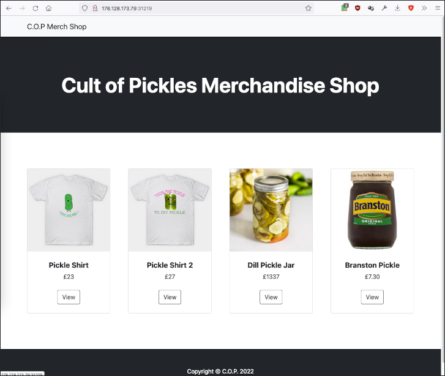
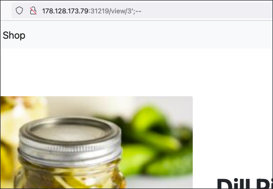

# Writeup "C.O.P"

## Quick Info

<table>
   <tr><td><b> site       </b></td><td> Hack the Box                                           </td></tr>
   <tr><td><b> url        </b></td><td> https://app.hackthebox.com/challenges/cop              </td></tr>
   <tr><td><b> discussion </b></td><td> https://forum.hackthebox.com/t/official-c-o-p-discussion </td></tr>
   <tr><td><b> type       </b></td><td> challenge/web                                          </td></tr>
   <tr><td><b> difficulty </b></td><td> easy                                                   </td></tr>
   <tr><td><b> startdate  </b></td><td> 2022-09-28                                             </td></tr>
   <tr><td><b> enddate    </b></td><td> __                                             </td></tr>
</table>

## Description

> The C.O.P (Cult of Pickles) have started up a new web store to sell their merch. We believe that the funds are being used to carry out illicit pickle-based propaganda operations! Investigate the site and try and find a way into their operation!

## Solution

We receive an IP and port to a server and a zip file containing the _Python Flask_ application deployed on the server. According to the `Dockerfile`, the application is deployed in the `/app` directory and the `supervisord.conf` file lists paths to log files. The page displays a basic pickle-themed webshop. Since the application uses the Python package `pickle`, this might be a hint.

<p align="center">
   
</p>

The page does not seem have any fields for user input and no cookies are used. The only place where any parameter can be manipulated is the endpoint for a product detail page, `/view/<product_id>`. When we inspect the files `routes.py`, `models.py`, and `database.py`, we see that the value of `<product_id>` is used for a _sqlite3_ database query without ever being sanitized! As a test, we try the payload `/view/3';--` and the system displays the page correctly. Not to find out how to exploit the vulnerability.

<p align="center">
   
</p>

As a next step, we try to execute the following SQLite commands using the vulnerability:
```
/view/3';INSERT INTO products (data) VALUES ("gASVgwAAAAAAAACMCF9fbWFpbl9flIwESXRlbZSTlCmBlH2UKIwEbmFtZZSMClRlc3QgVGl0bGWUjAtkZXNjcmlwdGlvbpSMCVRlc3QgRGVzY5SMBWltYWdllIwfL3N0YXRpYy9pbWFnZXMvcGlja2xlX3NoaXJ0LmpwZ5SMBXByaWNllIwDOTk5lHViLg==");--
/view/3';UPDATE products SET data='gASVgwAAAAAAAACMCF9fbWFpbl9flIwESXRlbZSTlCmBlH2UKIwEbmFtZZSMClRlc3QgVGl0bGWUjAtkZXNjcmlwdGlvbpSMCVRlc3QgRGVzY5SMBWltYWdllIwfL3N0YXRpYy9pbWFnZXMvcGlja2xlX3NoaXJ0LmpwZ5SMBXByaWNllIwDOTk5lHViLg==' WHERE id=3;--
```

However, this returns an internal server error.

```
HTB{__}
```

### Sources

[^1]: https://davidhamann.de/2020/04/05/exploiting-python-pickle/
[^2]: 
[^3]: 
