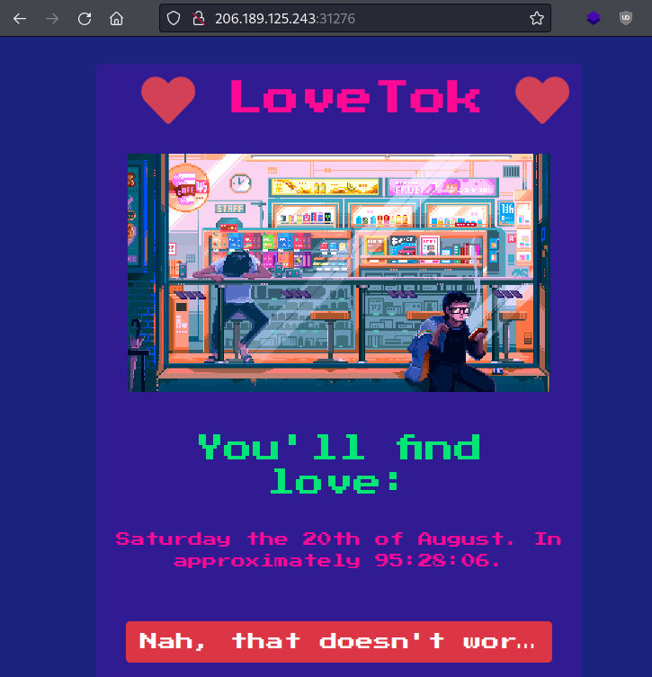
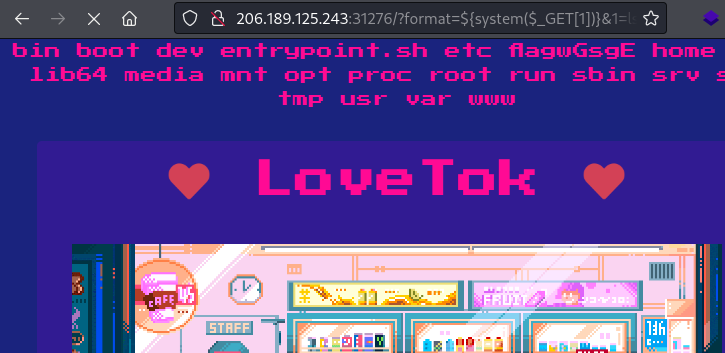
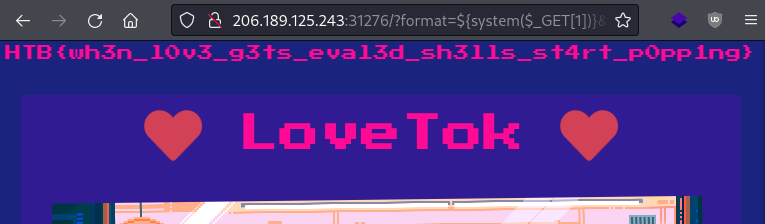

# Writeup "LoveTok"

## Quick Info

<table>
   <tr><td><b> site       </b></td><td> Hack the Box                                               </td></tr>
   <tr><td><b> url        </b></td><td> https://app.hackthebox.com/challenges/lovetok              </td></tr>
   <tr><td><b> discussion </b></td><td> https://forum.hackthebox.com/t/official-lovetok-discussion </td></tr>
   <tr><td><b> type       </b></td><td> challenge/web                                              </td></tr>
   <tr><td><b> difficulty </b></td><td> easy                                                       </td></tr>
   <tr><td><b> startdate  </b></td><td> 2022-08-16                                                 </td></tr>
   <tr><td><b> enddate    </b></td><td> 2022-08-16                                                 </td></tr>
</table>

## Description

> True love is tough, and even harder to find. Once the sun has set, the lights close and the bell has rung... you find yourself licking your wounds and contemplating human existence. You wish to have somebody important in your life to share the experiences that come with it, the good and the bad. This is why we made LoveTok, the brand new service that accurately predicts in the threshold of milliseconds when love will come knockin' (at your door). Come and check it out, but don't try to cheat love because love cheats back. 💛

## Solution

We receive an IP and port to a server and a zip file containing the _PHP_ application deployed on the server. The application displays a future date and claims that the user will "find love" then:

<p align="center">
   
</p>

There is no user input field on the page but the user can click on a button to try again. This reveals a GET parameter `format` which is set to the value `r`; This parameter influences how the prediction date is formatted.

Looking at the source code, the challenge looks very similar to the challenge [Toxic](toxic.md). Again, the application lies in the `/www` directory and the `flag` file is located in the root directory and its filename is randomized. The server software used is again Nginx.

We focus on finding the GET parameter in the source code and discover that is is treated using the PHP function `addslashes()`, which escapes certain dangerous characters[^1]. Then, it is used in a string which is interpreted using the PHP function `eval()`. A web search for _"php eval addslashes exploit"_ leads us to a page describing how to get around the `addslashes()` function in a situation like this[^2]. The trick is to use curly brackets (`{}`) to add a function call to the string which is passed to `eval()`. The function can then receive the content of a GET parameter. Our payload looks like this:

```
http://206.189.125.243:31276/?format=${system($_GET[1])}&1=whoami
```

We can now use the GET parameter `1` to execute shell commands on the server. The command `ls /` shows us the filename of the flag file:

<p align="center">
   
</p>

And the command `cat /flagwGsgE` prints out the flag:

<p align="center">
   
</p>

The flag is therefore:

```
HTB{wh3n_l0v3_g3ts_eval3d_sh3lls_st4rt_p0pp1ng}
```

### Sources

[^1]: https://www.php.net/manual/de/function.addslashes.php
[^2]: https://0xalwayslucky.gitbook.io/cybersecstack/web-application-security/php
[^3]: 
