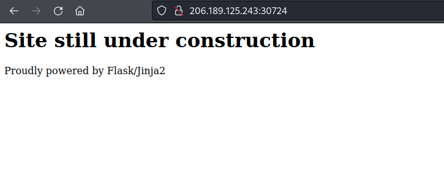
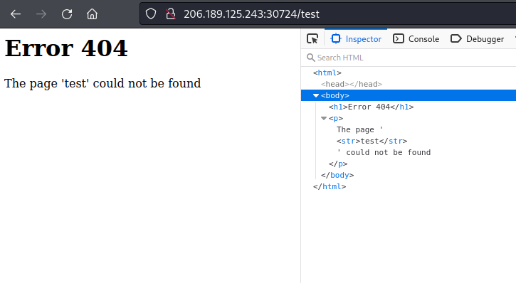
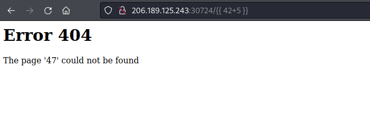
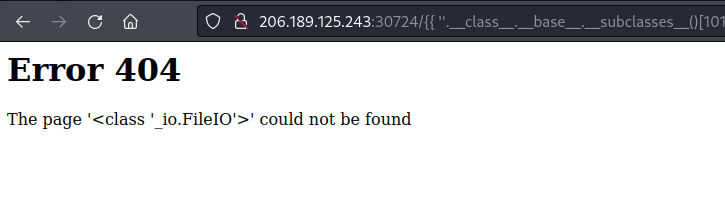
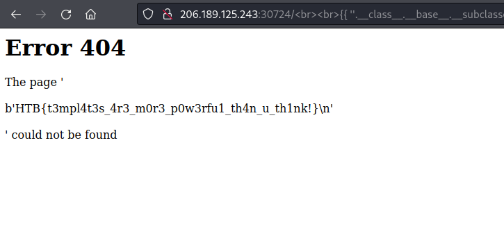

# Writeup "Templated"

## Quick Info

<table>
	<tr><td><b>site</b></td><td>Hack the Box</td></tr>
	<tr><td><b>url</b></td><td>https://app.hackthebox.com/challenges/templated</td></tr>
	<tr><td><b>discussion</b></td><td>https://forum.hackthebox.com/t/official-templated-discussion</td></tr>
	<tr><td><b>type</b></td><td>challenge/web</td></tr>
	<tr><td><b>difficulty&nbsp;&nbsp;&nbsp;</b></td><td>easy</td></tr>
	<tr><td><b>startdate</b></td><td>2022-08-08</td></tr>
	<tr><td><b>enddate</b></td><td>2022-08-08</td></tr>
</table>

## Description

> Can you exploit this simple mistake?

## Solution

We receive an IP and port to a server. When we access the server using a web browser, we see an 'under construction' site. The technology used is displayed (Flask/Jinja2), but no other infos can be found on this site:

<p align="center">
   
</p>

A web search for _"flask jinja2 vulnerability"_ points us in the right direction: under the right conditions, a Server Side Template Injection (SSTI) is possible. Often, this is done by changing the value passed to a HTTP GET parameter. In this case we cannot identify such parameters.

We decide to scan for additional files and folders using _gobuster_. However, we discover quickly that the server returns a status code `200` even for all pages, even for pages that do not exist. This makes it impossible to use _gobuster_ in this situation.

While investigating this behaviour, we notice that the error page contains the name of the page we tried to open. The usage of the non-standard `&lt;str&gt;` tag and the newlines around the name make us think that this string was included by the Flask/Jinja2 template:

<p align="center">
   
</p>

We decide to test whether an SSTI is possible by inserting the following Jinja2 placeholder:

```
{{ 42+5 }}
```

The response is promising:

<p align="center">
   
</p>

We decide to follow the article found earlier and start navigating the chain of Python objects starting with an empty string:

```
{{ ''.__class__ }}
```

This is working and we continue following the chain of objects. The only difficult part is finding out the correct index of the class `_io._IOBase` (it is 101). Finally, we find the `_io.FileIO` class using the string:

```
{{ ''.__class__.__base__.__subclasses__()[101].__subclasses__()[0].__subclasses__()[0] }}
```

<p align="center">
   
</p>

We can now use this string like the Python class `io.FileIO` described under [2]. Calling this class with a file path returns a `io.BufferedReader` object. Calling its `read()` method returns the file's contents:

```
{{ ''.__class__.__base__.__subclasses__()[101].__subclasses__()[0].__subclasses__()[0]('flag.txt').read() }}
```

<p align="center">
   
</p>

This gives us the flag:

```
HTB{t3mpl4t3s_4r3_m0r3_p0w3rfu1_th4n_u_th1nk!}
```

## Sources

1. https://kleiber.me/blog/2021/10/31/python-flask-jinja2-ssti-example/
2. https://docs.python.org/3/library/io.html
