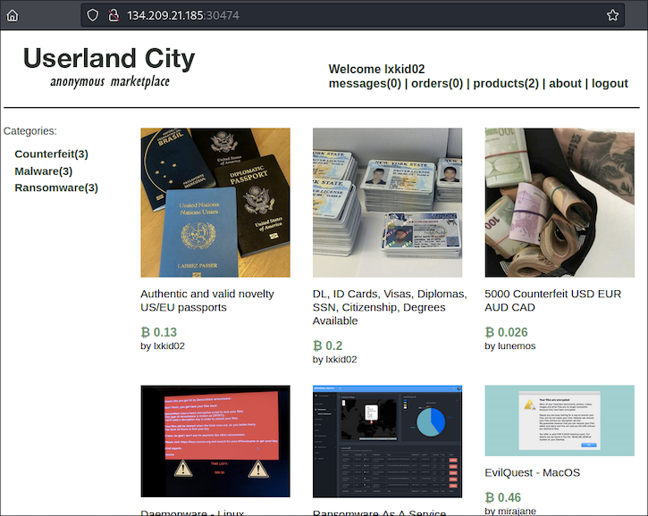
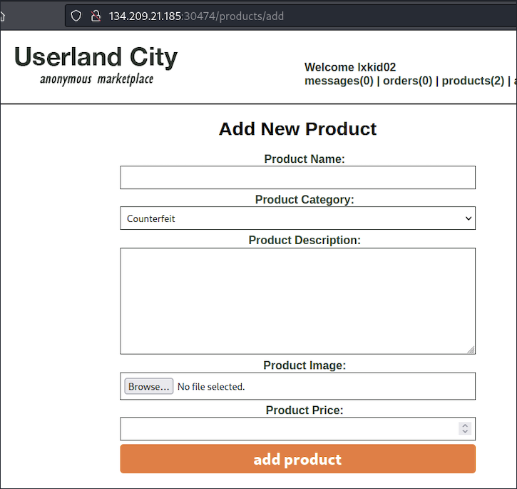

# Writeup "Userland City"

## Quick Info

<table>
   <tr><td><b> site       </b></td><td> Hack the Box                                                     </td></tr>
   <tr><td><b> url        </b></td><td> https://app.hackthebox.com/challenges/userland-city              </td></tr>
   <tr><td><b> discussion </b></td><td> https://forum.hackthebox.com/t/official-userland-city-discussion </td></tr>
   <tr><td><b> type       </b></td><td> challenge/web                                                    </td></tr>
   <tr><td><b> difficulty </b></td><td> medium                                                           </td></tr>
   <tr><td><b> startdate  </b></td><td> 2022-08-17                                                       </td></tr>
   <tr><td><b> enddate    </b></td><td> -                                                       </td></tr>
</table>

## Description

> You are part of a multinational law enforcement operation called "Takeover" that targets underground darknet markets, the new target is a referral only market called Userland City. After a string of ops intercepting traffic in TOR exit nodes, we managed to obtain a verified vendor's account that goes by the name of lxkid. We're ready for stage "Downfall", Europol has provided us with key software components to capture cleartext credentials from all marketplace users, spyware to deliver through key accounts operating with downloadable deliveries, and help us remove the existing image database including the metadata removal tool. Old IRC logs from one of those devs suggest that the marketplace is built on top of the latest Laravel version and debug mode is enabled. The credentials of the vendor's account are lxkid02:8rsNN9ohfLp69cVRFEgk4Qzs

## Solution

At the given IP, we find a login mask including a captcha challenge. After logging in using the given credentials, we can access "Userland City", an anonymous marketplace:

<p align="center">
   
</p>

Following the _"About"_ link, we find a page with a news feed containing mostly messages from a user called @dread_pirate_roberts. In the _"Products"_ page, we find a link for creating new products:

<p align="center">
   
</p>

Using the informations given in the challenge description, we perform a web search for _"laravel debug mode vulnerability"_. We find a page which describes a way to exploit the debug mode by provoking an error[^1]. The resulting error page provides some debugging features which can be used to alter the webpage code. The exploit description uses a very interesting tool called `phpggc`[^2]; in the description page of this tool we find the concept of _"polygot files"_ which are simultaneously valid files for two or more file formats[^3], e.g. `phar` and `jpeg`. Since we can only upload images, this looks like a useful concept.

```
HTB{__}
```

### Sources

[^1]: https://www.ambionics.io/blog/laravel-debug-rce
[^2]: https://github.com/ambionics/phpggc
[^3]: https://medium.com/swlh/polyglot-files-a-hackers-best-friend-850bf812dd8a
